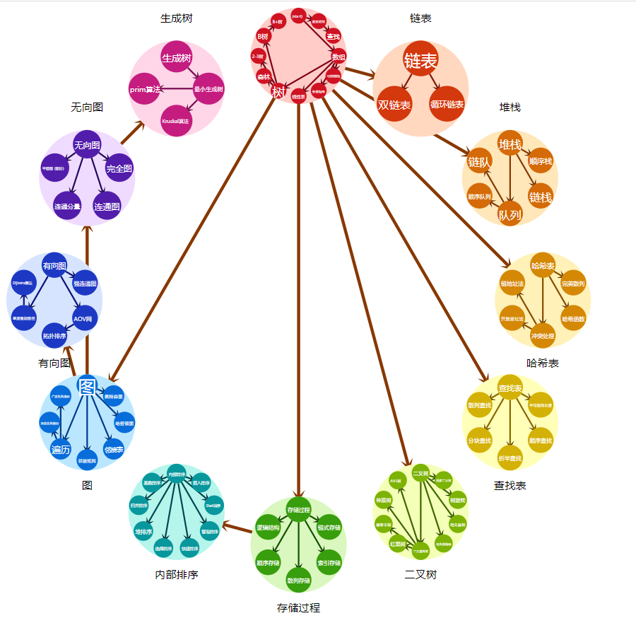

# Topic-dependence-visualization

## drawMap模块
### Input
- `data` 认知关系数据，格式如`gaozhongshuxue.ts`
- `svg` 显示认知关系的svg元素，需要设置宽高
- `treesvg` 显示分面树的svg元素，不要设置宽高，但需要使其浮于认知关系图之上
- `learningPath: number[]` 知识主题id列表，用来显示推荐认知路径
- `clickTopic(topicId: number, topicName: string)` 点击知识主题的响应函数
- `clickFacet(facetId: number)` 点击分面的响应函数

### Output
- Circular layout between data

## drawCommunity模块（仅绘制知识簇）
### Input
- `data`
- `svg`
- `clickCom(d)`
### Output
- Circular layout between clusters

# drawTopic模块（仅绘制知识簇内）
### Input
- `id`
- `data`
- `svg`
- `clickTopic(topicId: number, topicName: string)`
### Output
- Circular layout between topics in clusters

## Build
`npm run build` 打包结果在 `/module/topicDependenceVisualization.js`

## Usage
1. download 'topicDependenceVisualization.js' from 'release' tab
2. import 'drawMap'/'drawCommunity'/'drawTopic'(refer to 'index.ts')
`drawMap(data, svg, treesvg, domainName, learningPath, clickTopic, clickFacet)`
